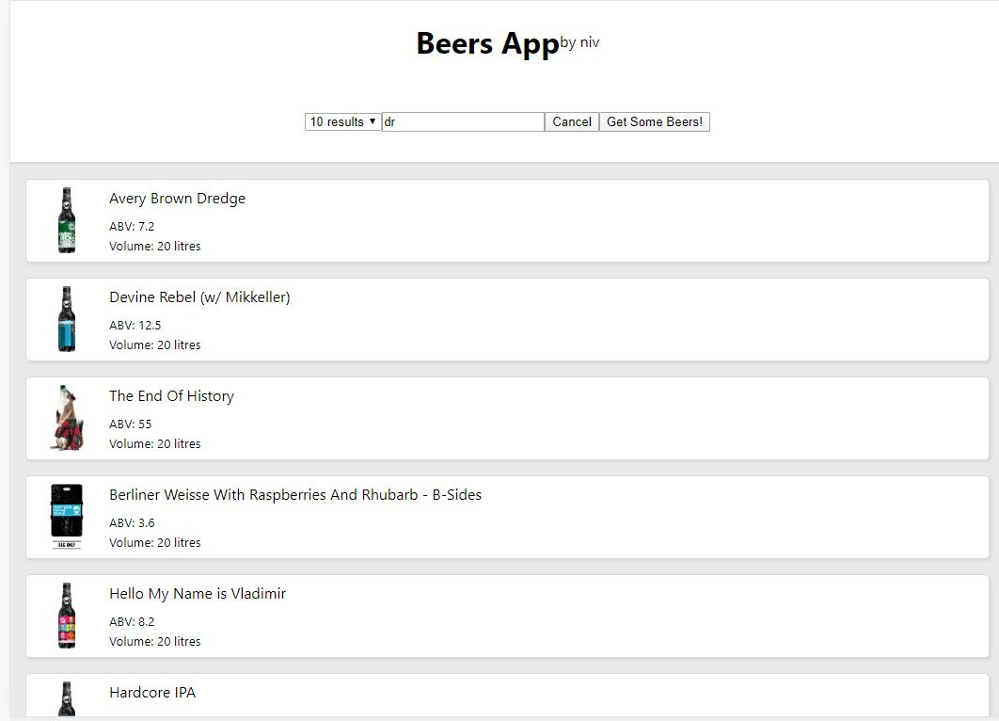

### RXJS beers App

## Stuck :
React, Redux, Redux-observable, RxJS

SCREEN SHOT :

## React Available Scripts

In the project directory, you can run:

* `npm start`

Runs the app in the development mode. 
Open [http://localhost:3000](http://localhost:3000) to view it in the browser.

* `npm test`

Launches the test runner in the interactive watch mode. 
See the section about [running tests](https://facebook.github.io/create-react-app/docs/running-tests) for more information.

* Learn More

You can learn more in the [Create React App documentation](https://facebook.github.io/create-react-app/docs/getting-started).

To learn React, check out the [React documentation](https://reactjs.org/).

## Notes for myself

I (or anyone else) can use it to remind them self the usage of 
Redux-Observable and RxJS.
I added in the project branches from phase errors,
and some verbose comments for the ongoing teaching issue
(when I have time I would go back and add the first phases).

In the end of the file there will be several features, such as :
search with debounce Observable, cancel mid-air Ajax, group send of Ajax,
changing state from the redux-observable lib, using dependencies, 
and testing observables.

** There are some file names and variables changes between the branches, 
so keep that in mind if you want to copy this into your project
from one branch to the second branch some errors may occur
but can be easily fixed.
